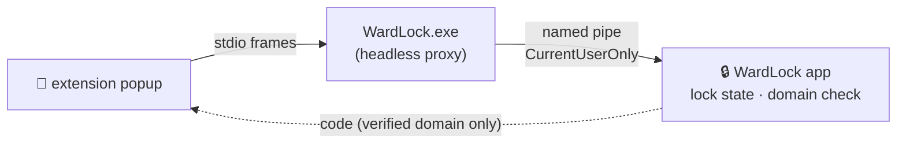

<div align="center">

```
██╗    ██╗ █████╗ ██████╗ ██████╗ ██╗      ██████╗  ██████╗██╗  ██╗
██║    ██║██╔══██╗██╔══██╗██╔══██╗██║     ██╔═══██╗██╔════╝██║ ██╔╝
██║ █╗ ██║███████║██████╔╝██║  ██║██║     ██║   ██║██║     █████╔╝
██║███╗██║██╔══██║██╔══██╗██║  ██║██║     ██║   ██║██║     ██╔═██╗
╚███╔███╔╝██╔══██║██║  ██║██████╔╝███████╗╚██████╔╝╚██████╗██║  ██╗
 ╚══╝╚══╝ ╚═╝  ╚═╝╚═╝  ╚═╝╚═════╝ ╚══════╝ ╚═════╝  ╚═════╝╚═╝  ╚═╝
```

### `⟨ YOUR CODES ⟩ ⟨ YOUR MACHINE ⟩ ⟨ NO CLOUD ⟩`

**The Windows authenticator that types the code for you — and only on the real site.**

[](#building-from-source)
[](#building-from-source)
[](PRIVACY.md)
[](#-totp-engine)
[](#-shared-team-vaults)

</div>

---

```
┌────────────────────────────────────────────────────────────────┐
│ > initiating one-keystroke code delivery ...                   │
│ > CTRL+SHIFT+T ........ code typed into focused field   [ OK ] │
│ > browser fill ........ domain verified: github.com     [ OK ] │
│ > lookalike blocked ... github.com.evil.com           [DENIED] │
│ > vault audit chain ... 1,337 entries, SHA-256 chain    [ OK ] │
└────────────────────────────────────────────────────────────────┘
```

Since Authy abandoned the desktop, Windows-first 2FA users retype codes from their phones like it's 2011. WardLock ends that: a lightweight WPF authenticator where the current code is always **one keystroke away** — globally hotkeyed, auto-typed, or filled in the browser with phishing-resistant domain verification. Everything runs on your machine. Nothing phones home.

## ▰▰ Feature Grid ▰▰

| Capability | Status | The short version |
|---|---|---|
| ⚡ Global auto-type | `ONLINE` | `Ctrl+Shift+T` types the current code into any focused field |
| 🌐 Browser fill | `ONLINE` | MV3 extension, domain-verified, 100% local native messaging |
| 🔗 Shared team vaults | `ONLINE` | Encrypted vault file on any share; codes generate locally |
| 👁 Viewer role | `ONLINE` | Two-key wrapping: viewers get codes, never seeds |
| 📜 Vault audit trail | `ONLINE` | Hash-chained, tamper-evident, CSV export |
| 🎮 Steam Guard | `ONLINE` | Import migrated `otpauth://steam` secrets, native 5-char codes |
| 📷 QR everything | `ONLINE` | Scan from screen, file, or clipboard; Google Auth migration |
| 🔐 App lock | `ONLINE` | Windows Hello / password / Google / Microsoft / Facebook |
| 🔢 Number-matched release | `ONLINE` | 2-digit out-of-band approval for browser fills — serverless MFA-fatigue armor |
| 📡 Push-approved release | `BUILDING` | Number-matching approval for team vaults ([#3](https://github.com/michaeladixon/WardLock/issues/3)) |

## ⚡ One-Keystroke Code Delivery

### Global auto-type — `Ctrl+Shift+T`

Press it anywhere, even with WardLock in the tray. WardLock reads the focused window's title, matches it to an account (a browser tab titled *"Sign in to GitHub"* matches your GitHub entry), and types the current code via `SendInput` — keyboard-layout independent, Steam codes included. Ambiguous match? A filterable picker materializes at your cursor. Locked vault? **Nothing gets typed, ever** — the lock screen surfaces instead.

### Browser fill — domain-verified, phishing-resistant

A Chrome/Edge (MV3) extension delivers codes with one click — **and only on the real site**:

- Each account stores a **fill domain** (right-click → *Set Fill Domain…*, e.g. `github.com`).
- The extension only offers a code when the page's hostname equals that domain or is a subdomain of it — matched at **label boundaries**, never substring. `github.com.evil.com` and `evilgithub.com` can never receive your GitHub code.
- Communication is 100% local: `WardLock.exe` doubles as the native-messaging host, relaying browser requests over a per-user named pipe to the running app. No cloud. No phone. No account.
- The app validates the calling extension's identity on every connection and refuses all requests while locked. Accounts without a fill domain are invisible to the browser.



**Setup:** menu (≡) → **Enable Browser Integration**, then load [`BrowserExtension/`](BrowserExtension/README.md) unpacked at `chrome://extensions`. Not compatible with MSIX-installed builds yet (browsers can't launch executables inside `WindowsApps`) — use a loose build.

### Number-matched code release — MFA-fatigue armor, zero servers

The anti-fatigue property of Microsoft Authenticator's number matching, rebuilt **entirely locally** on the native-messaging channel:

- Flag an account (right-click → *Require Approval to Fill*) and every browser fill turns into a challenge: the extension popup shows a random **2-digit number**, and WardLock's own window asks you to type it.
- The approval happens **out-of-band** — in the app window the requesting surface doesn't control. A spoofed page, a compromised extension, or a reflexive "Allow" click can never release a code; you have to *transcribe* the number you see in the browser.
- One-shot and time-boxed: 60 s to type it, 3 wrong entries deny it, the released code can be picked up exactly once, and a locked vault cancels everything.
- **Forced on for the first 24 h after a new browser pairing** — a freshly installed (or freshly impersonated) browser profile gets no silent fills, flag or no flag.
- For team-vault accounts, requests, approvals, and denials all land in the hash-chained audit trail.

## 🔢 TOTP Engine

6/8-digit codes, SHA-1/SHA-256/SHA-512, configurable periods, live countdown, click-to-copy. Codes render green (personal) or mauve (vault) so you always know a secret's blast radius.

**Steam Guard:** URIs using `otpauth://steam/...` (Aegis exports) or `encoder=steam` (KeePassXC exports) import directly and render Steam's 5-character alphabet. Steam offers no official way to extract your shared secret — WardLock imports one you already liberated via another app's export.

## 🔗 Shared Team Vaults

The capability the team-2FA SaaS products charge for, delivered as a file: create a `.wardlock` vault, drop it on a network share / OneDrive / SharePoint, share the password out-of-band. Every member's codes generate locally — secrets never transit the network in plaintext.

- AES-256-GCM encryption (PBKDF2-SHA256, 600k iterations), same format as backups
- Vault secrets live in memory only — never written to any user's DPAPI profile
- `FileSystemWatcher` syncs teammate changes live; file locking prevents write corruption
- Per-account source badges; "Add to" dropdown routes new accounts to any open vault
- Move accounts between Personal ⇄ vault with automatic re-encryption

### 👁 Viewer role — codes without the keys to the kingdom

Give teammates a **viewer password** (👁 next to an open vault) and they get
current codes — copy, auto-type, browser fill, the works — while the seeds
never enter their process. Not a UI flag: two-key wrapping. Admin and viewer
passwords unwrap different keys, and the viewer's key decrypts only metadata
plus **precomputed code windows** (72 h ahead, refreshed whenever an admin's
client touches the vault). A viewer's client *cannot* export a seed, mint a
valid vault write, or outlive a password rotation — the crypto, not the
goodwill, enforces it. Full rationale and honest limits: [`docs/viewer-role.md`](docs/viewer-role.md).

There is one honest tradeoff, and you should know it before relying on the
role: TOTP without a server means viewers hold *windows* of future codes, so
if no admin opens the vault within the horizon, viewers see `code expired`
until one does. That staleness is the price of "no seed on the viewer's
machine" with no cloud in the loop.

### 📜 Audit Trail — tamper-evident, serverless

Every vault keeps an append-only sidecar log (`team-vault.wardlock.log`): vault created/opened, accounts added/removed, fill-domain changes, and **every code access** — clipboard copy, hotkey auto-type (with target window title), browser fill (with requesting domain) — stamped with the member's Windows username and UTC time.

Each record embeds the previous record's SHA-256. Edit, delete, or reorder anything and the chain breaks — flagged with a tamper warning in the viewer (📜 next to each open vault). Export to CSV for compliance.

> **Threat model — read before relying on it:** the chain makes silent *modification* of history evident; it does not make the log unforgeable. A member with write access can delete the log wholesale or truncate its tail (evident only against retained CSV snapshots), and identity comes from the Windows username. It's an honest-participant accountability trail — the same guarantee level the paid SaaS products offer — not a cryptographic seal against a malicious insider.

## 🔐 App Lock

| Method | Backing |
|---|---|
| Windows Hello | Fingerprint / face / PIN via WinRT `UserConsentVerifier` |
| Password | PBKDF2-SHA256 hash, never stored in plaintext |
| Google / Microsoft / Facebook | OAuth in your default browser; unlock bound to your `sub` claim |
| None | Straight to codes (default) |

Auto-lock after idle (default 5 minutes, configurable). A locked vault serves **nothing**: no window, no auto-type, no browser fill.

## 📷 Getting Accounts In

1. **QR scan** — full-screen auto-detect with a draw-a-box fallback, image files, or clipboard screenshots
2. **Google Authenticator migration** — scan the *Export accounts* QR straight in
3. **`otpauth://` URI** — paste from any "can't scan?" link
4. **Manual** — issuer, label, Base32 secret, optional fill domain
5. **Encrypted backup import** — restore a `.wardlock` backup; secrets re-encrypt under your local DPAPI

Backups export the same way: AES-256-GCM, password-protected, one file.

## ◢ How It Works ◤

- **TOTP** via [Otp.NET](https://github.com/kspearrin/Otp.NET) (RFC 6238)
- **Secrets at rest** → Windows DPAPI, user-scoped, bound to your login
- **Backups / vaults** → AES-256-GCM + PBKDF2-SHA256 (600k iterations)
- **Global hotkeys** → Win32 `RegisterHotKey`; typing via `SendInput` (`KEYEVENTF_UNICODE`)
- **Browser bridge** → Chrome native messaging (stdio) → named pipe (`CurrentUserOnly`)
- **Audit chain** → SHA-256 hash-linked JSON lines, exclusive-lock appends
- **QR** → [ZXing.NET](https://github.com/micjahn/ZXing.Net) + GDI+ screen capture
- **Tray** → [Hardcodet.NotifyIcon.Wpf](https://github.com/hardcodet/wpf-notifyicon)
- **Storage** → `%LOCALAPPDATA%\WardLock\` (`accounts.json`, `settings.json`)

Privacy statement: [PRIVACY.md](PRIVACY.md) — the short version is *there is nothing to disclose because nothing leaves your machine*.

## ⌨ Keyboard Shortcuts

| Keys | Action |
|---|---|
| `Ctrl+Shift+T` | **Auto-type current code into focused field** (global) |
| `Ctrl+Shift+A` | Show / hide WardLock (global) |
| `Ctrl+F` | Search accounts |
| `Click entry` | Copy code to clipboard |
| `Esc` | Cancel search / picker / QR region selector |

## 🛠 Building from Source

**Requirements:** Windows 10 build 19041+, .NET 10 SDK

```
dotnet restore
dotnet build -c Release -r win-x64
dotnet run
```

### MSIX installer (sideload)

```powershell
.\build-msix.ps1
```

Handles everything: self-signed cert, visual assets, publish, `MakeAppx.exe`, `SignTool.exe`. First run installs the cert to `TrustedPeople` (elevated prompt, or sideload manually). Then:

```powershell
Add-AppxPackage -Path .\WardLock_1.0.0.0.msix
```

| Flag | Purpose |
|---|---|
| `-Version "1.2.0.0"` | Set the package version |
| `-SkipCert` | Reuse an existing cert |
| `-SkipAssets` | Skip icon generation |
| `-RunWack` | Run Windows App Certification Kit after build |
| `-Store` | Partner Center identity, unsigned (Store re-signs) |

### Releases (CI)

Tagging `vX.Y.Z` on a `release/x.y.z` branch runs the [release workflow](.github/workflows/release.yml): store + sideload MSIX and a loose zip land on a GitHub Release, and an approval-gated job publishes to the Microsoft Store via `msstore`. Process and one-time setup: [`docs/releasing.md`](docs/releasing.md).

**Store submission:** `.\build-msix.ps1 -Store -Version "1.0.0.0"` → upload to Partner Center.

*Requires the Windows 10/11 SDK for `MakeAppx.exe` / `SignTool.exe`.*

## 🗂 Project Structure

```
WardLock/
├── Behaviors/
│   └── DragDropReorder.cs            # ListBox drag-and-drop reordering
├── BrowserExtension/                 # MV3 Chrome/Edge extension (load unpacked)
├── Models/
│   ├── AuthAccount.cs                # Account model (+ fill domain, Steam encoder)
│   └── ExportPayload.cs              # Encrypted backup/vault format
├── Services/
│   ├── AccountStore.cs               # JSON persistence + otpauth:// parsing
│   ├── AppSettings.cs                # Settings + remembered vaults
│   ├── AutoTypeService.cs            # Foreground detection + SendInput typing
│   ├── BrowserBridge/                # Native messaging: framing, proxy, server, installer
│   ├── DomainMatcher.cs              # Label-anchored registrable-domain matching
│   ├── ExportImportService.cs        # AES-256-GCM export/import
│   ├── GlobalHotkeyService.cs        # Win32 hotkey registration
│   ├── GoogleAuthMigrationDecoder.cs # Google Authenticator migration QR
│   ├── OAuthService.cs               # OAuth unlock flows
│   ├── PasswordLockService.cs        # PBKDF2 app-lock password
│   ├── QrScanner.cs                  # Screen/file/clipboard QR decoding
│   ├── SecretVault.cs                # DPAPI wrapper
│   ├── SharedVaultService.cs         # Team vaults: open/create/watch/edit
│   ├── TotpGenerator.cs              # RFC 6238 + Steam encoding
│   ├── VaultAuditLog.cs              # Hash-chained tamper-evident audit trail
│   ├── VaultPasswordCache.cs         # DPAPI-cached vault passwords
│   └── WindowsHelloService.cs        # WinRT biometric verification
├── ViewModels/
│   ├── AccountViewModel.cs           # Per-account display + copy + badges
│   ├── MainViewModel.cs              # Orchestration + vaults + lock methods
│   ├── MainViewModel.AutoType.cs     # Window-title matching + auto-type flow
│   ├── MainViewModel.BrowserBridge.cs# Extension requests + fill domains
│   ├── MainViewModel.Search.cs       # Filtering + idle auto-lock
│   └── Services/                     # QR + shared-vault coordinators
├── Views/
│   ├── AuditLogWindow.xaml/.cs       # Audit viewer + CSV export
│   ├── AutoTypePickerWindow.xaml/.cs # Cursor-anchored account picker
│   ├── InputDialog.xaml/.cs          # Fill-domain prompt
│   ├── PasswordDialog.xaml/.cs       # Vault/backup password entry
│   └── ScreenCaptureOverlay.xaml/.cs # QR region selector
├── MainWindow.xaml/.cs               # Main UI + tray + hotkey lifecycle
└── App.xaml/.cs                      # Startup + native-messaging proxy mode
```

## 🗺 Roadmap

| Trace | Target |
|---|---|
| [#1](https://github.com/michaeladixon/WardLock/issues/1) | ~~Auto-type~~ ✓ · ~~Browser fill~~ ✓ · local number-matched release · Firefox port |
| [#3](https://github.com/michaeladixon/WardLock/issues/3) | ~~Audit trail~~ ✓ · viewer roles · WNS push-approved code release with number matching |
| [#4](https://github.com/michaeladixon/WardLock/issues/4) | WardLock as an Entra ID External Authentication Method *(strategic, parked)* |
| [#5](https://github.com/michaeladixon/WardLock/issues/5) | Subscription/entitlement rail on `api.wardlock.app` — personal TOTP stays free forever |

<div align="center">

```
─────────────────────────────────────────────
 ⟨ wardlock ⟩ — locally yours. © WardLock 2026
─────────────────────────────────────────────
```

</div>
